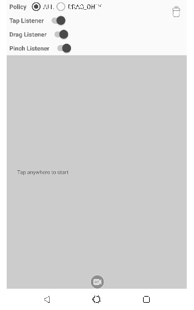
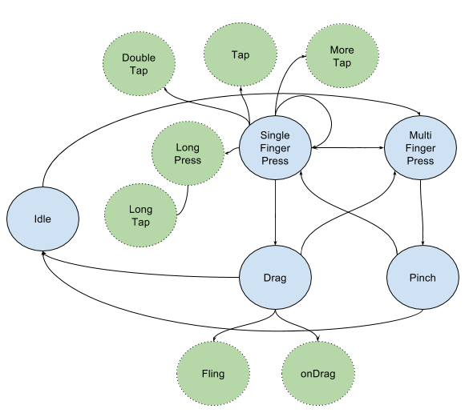

Collage Gesture Detector
===

[](https://circleci.com/gh/cardinalblue/collage-gesture-detector-android)
[  ](https://bintray.com/cblue/android/collage-gesture-detector/_latestVersion)
[  ](https://bintray.com/cblue/android/collage-gesture-detector-rx/_latestVersion)



The system built-in `GestureDetector` has no concept of gesture lifecycle. We enclose gesture callbacks with lifecycle so that you could something in the **onActionBegin** and do anothing in the **onActionEnd** callbacks.

Gradle
---

Add this into your dependencies block.

```
// For gradle < 3.0
compile 'com.cardinalblue.gesture:collage-gesture-detector:3.1.2'
// Optional Rx 
compile 'com.cardinalblue.gesture:collage-gesture-detector-rx:3.1.2'

// For gradle >= 3.0, use "api" or "implementation"
implementation 'com.cardinalblue.gesture:collage-gesture-detector:3.1.2'
// Optional Rx 
implementation 'com.cardinalblue.gesture:collage-gesture-detector-rx:3.1.2'
```

If you cannot find the package, add this to your gradle repository

```
maven {
    url 'https://dl.bintray.com/cblue/android'
}
```

Usage
---

### Without RxJava

Instantiate the detector instance

```kotlin
private val mGestureDetector by lazy {
    GestureDetector(Looper.getMainLooper(),
                    ViewConfiguration.get(context),
                    resources.getDimension(R.dimen.touch_slop),
                    resources.getDimension(R.dimen.tap_slop),
                    resources.getDimension(R.dimen.fling_min_vec),
                    resources.getDimension(R.dimen.fling_max_vec))
}
```

Register the listener

```kotlin
// Gesture listener.
mGestureDetector.addLifecycleListener(...)
mGestureDetector.addTapGestureListener(...)
mGestureDetector.addDragGestureListener(...)
mGestureDetector.addPinchGestureListener(...)
```

Add to your view's onTouchEvent()

```kotlin
override fun onTouchEvent(event: MotionEvent): Boolean {
    return mGestureDetector.onTouchEvent(event, null, null)
}
```

If you use flat view hierarchy designed by yourself, the 2nd and 3rd arguements are useful for you. For example:

```kotlin
override fun onTouchEvent(event: MotionEvent): Boolean {
    return mGestureDetector.onTouchEvent(event, 
                                         someTouchingObject, 
                                         payloadOrContext)
}
```

That's it and so simple!

### With RxJava

If you'd prefer the Rx way, try as following:

- Add this to `build.gradle` 

```
// For gradle < 3.0
// Rx add-on 
compile 'com.cardinalblue.gesture:collage-gesture-detector-rx:?.?.?'

// For gradle >= 3.0, use "api" or "implementation" 
implementation 'com.cardinalblue.gesture:collage-gesture-detector-rx:?.?.?'
```

- Feed the detector to the `GestureEventObservable`:

```kotlin
GestureEventObservable(gestureDetector = ${YOUR_COLLAGE_GESTURE_DETECTOR})
    .subscrible { event ->
        // Handle event... 
    }
```

### Callbacks

Lifecycle callbacks:

```
void onActionBegin();

void onActionEnd();
```

TAP related callbacks:

```
void onSingleTap();

void onDoubleTap();

void onMoreTap();

void onLongTap();

void onLongPress();
```

DRAG related callbacks:

```
boolean onDragBegin();

void onDrag();

void onDragEnd();

boolean onDragFling();
```

PINCH related callbacks:

```
boolean onPinchBegin();

void onPinch();

void onPinchEnd();
```

Checkout the details in the code, [interface link](library/src/main/java/com/cardinalblue/gesture/IGestureListener.java).

### The State Diagram




Revisions
---

[link](CHANGELOG.md)
