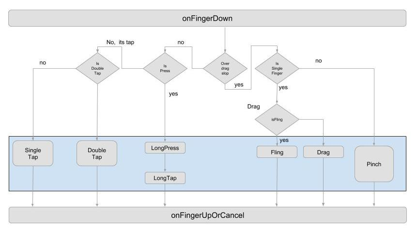

Gesture Detector
===

The system built-in `GestureDetector` has no concept of gesture lifecycle. We enclose gesture callbacks with lifecycle so that you could something in the **onActionBegin** and do anothing in the **onActionEnd** callbacks.

Gradle
---

Add this into your dependencies block.

```
// For gradle < 3.0
compile 'com.cardinalblue.gesture:collage-gesture-controller:1.0.0'

// For gradle >= 3.0
implementation 'com.cardinalblue.gesture:collage-gesture-controller:1.0.0'
```

If you cannot find the package, add this to your gradle repository

```
maven {
    url 'https://dl.bintray.com/cblue/android'
}
```

Wiki
---

### Usage

constructing...

### General

Recognized gestures:

```
void onActionBegin();

void onActionEnd();

void onSingleTap();

void onDoubleTap();

void onMoreTap();

void onLongTap();

void onLongPress();

// Drag ///////////////////////////////////////////////////////////////

boolean onDragBegin();

void onDrag();

void onDragEnd();

// Fling //////////////////////////////////////////////////////////////

boolean onDragFling();

// Pinch //////////////////////////////////////////////////////////////

boolean onPinchBegin();

void onPinch();

void onPinchEnd();
```

Checkout the details in the code, [interface link](library/src/main/java/com/cardinalblue/gesture/IGestureListener.java).

### The State Diagram


